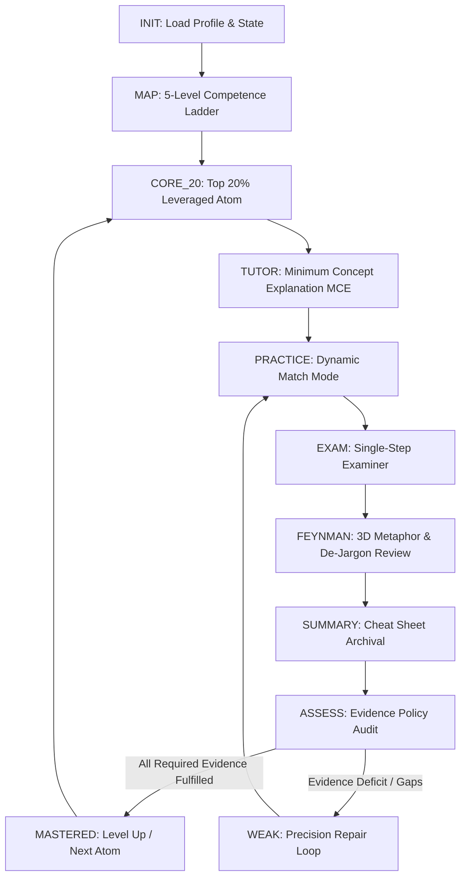

<div align="center">

# AI Personal Learning OS
### Protocol Specification v1.0

An evidence-based, state-machine-driven personal learning protocol designed for AI Agents and Large Language Models.

[](#)
[](#)
[](#)
[](#)
[](#)

[Overview](#overview) • [Core Philosophy](#core-philosophy) • [FSM State Machine](#state-machine-topology) • [Evidence Policy](#evidence-chain-matrix) • [Execution Modules](#execution-modules) • [Dual-Mode Runtime](#dual-mode-runtime-guide) • [Quick Start](#quick-start)

---

</div>

## Overview

**AI Personal Learning OS (`ai-learning-coach`)** is a rigorous engineering learning protocol that transforms AI from a passive "code generator / spoon-feeding tutor" into an **active resistance trainer, examiner, and persistent state keeper**.

Traditional AI learning suffers from two fatal flaws:
1. **The Illusion of Competence**: Reading AI explanations makes learners feel they understand, but they fail during blank-page coding or edge-case reasoning.
2. **Context Amnesia & Bloat**: Ephemeral chat logs lose learning progress, mistaken intuitions, and mastered evidence.

`ai-learning-coach` solves this by introducing a **Finite State Machine (FSM)**, a verifiable **E1~E5 Elastic Evidence Policy**, and a **Three-Tier Decoupled Architecture** that works both in local file-system IDEs (Cursor, Claude Code, Antigravity) and web-based LLMs (ChatGPT, Claude, Gemini).

---

## Core Philosophy

```
+-----------------------------------------------------------------------------------+
|                              THREE-TIER ARCHITECTURE                              |
+-----------------------------------------------------------------------------------+
|  [PROTOCOL]   SKILL.md             Rule Hierarchy & FSM Engine Orchestration      |
|  [MODULES]    modules/*.md         Practice, Examiner, Feynman, Assessment, Suspend|
|  [STATE]      state/**/*.md        Persistent Profiles, Subject States & Logs      |
+-----------------------------------------------------------------------------------+
```

- **Output-Driven (输出驱动)**: The learner writes code, predicts output, and simplifies mental models; the AI injects cognitive resistance, diagnoses blind spots, and arbitrates state progression.
- **Evidence-Based Mastery (证据链验收)**: True mastery is strictly defined by demonstrable evidence tokens (`E1` to `E5`), completely eliminating subjective "I feel I get it" assessments.
- **Three-Tier Decoupled Architecture (三权分立)**:
  - **Protocol (`SKILL.md`)**: Defines state transitions, priority hierarchy, and interrupt contracts.
  - **Modules (`modules/`)**: Stateless execution engines (Examiner, Practice Modes, Feynman, Recovery).
  - **State (`state/`)**: File-based git-trackable memory of subject levels, evidence logs, and mistake histories.
- **Zero-Noise State IO (静默与精准反馈)**: Suppresses conversational boilerplate; state updates occur strictly at stage transitions, explicit queries (`/status`), and session terminations.

---

## State Machine Topology

The learning engine follows a deterministic, unidirectional graph with strict gating and repair loops:



### State Responsibilities

| State | Purpose | Associated Module / Template |
| :--- | :--- | :--- |
| `INIT` | Read `state/profile.md` and subject state; initialize on cold start | `state/profile.md` |
| `MAP` | Generate a 5-level competence ladder and assign `evidence_policy` per atom | `modules/assessment.md` |
| `CORE_20` | Lock into the 20% highest-leverage atom for the current level | `templates/subject-state.md` |
| `TUTOR` | Deliver Minimum Concept Explanation (MCE, strictly <=15 lines code) | `SKILL.md` |
| `PRACTICE` | Execute dynamic practice modes tailored to the atom | `modules/practice.md` |
| `EXAM` | Conduct single-question, lock-step interactive examination | `modules/examiner.md` |
| `FEYNMAN` | Penetrate jargon and test mental model stability under stress | `modules/feynman.md` |
| `SUMMARY` | Generate and persist a condensed one-page reference card | `templates/cheat-sheet.md` |
| `ASSESS` | Tally evidence fulfillment and decide pass/repair | `modules/assessment.md` |

---

## Evidence Chain Matrix

Knowledge acquisition is certified only when designated evidence tokens are fulfilled:

```
  [ E1: Explain ]   Understand root mechanisms & core problem solved
  [ E2: Predict ]   推演 / Trace execution & state transitions mentally without running code
  [ E3: Build   ]   Implement production paradigm from scratch without hints
  [ E4: Debug   ]   Isolate hidden edge-case defects and explain root causes
  [ E5: Boundary]   Identify anti-patterns, runtime side effects, and constraints
```

### Elastic Evidence Policies

Different knowledge types require distinct verification strategies:

- **Standard (标准型)**: `required: [E1, E3, E5]` | `optional: [E2, E4]` (e.g., Design patterns, framework APIs)
- **Mechanism (深度原理型)**: `required: [E1, E2, E5]` | `optional: [E3, E4]` (e.g., Event loop, GC, type systems)
- **Tooling (工具语法型)**: `required: [E3, E4]` | `optional: [E1]` (e.g., Git commands, regex, build tools)

### `/skip` Bypass Challenge
When `/skip` is invoked, the AI synthesizes a **single comprehensive challenge** combining code construction and edge-case validation. Passing lights up all required evidence tokens immediately; failure redirects to targeted repair.

---

## Execution Modules

### 1. Practice Engine (`modules/practice.md`)
Dynamically switches between 6 specialized training modes:
- `BUILD`: Write standard implementations from scratch given rigorous specifications.
- `DEBUG`: Locate and resolve subtle runtime/type defects in pre-constructed snippets.
- `MODIFY`: Refactor functional but suboptimal/leaky code into robust structures.
- `PREDICT`: Mentally trace non-intuitive execution orders and execution contexts.
- `EXPLAIN`: Deconstruct systemic timings and protocols into structured text diagrams.
- `DESIGN`: Model types, interfaces, and architecture under domain constraints.

### 2. Single-Step Examiner (`modules/examiner.md`)
- **Lock-Step**: Strictly one question per prompt round.
- **Inspirational Feedback**: Never leaks solutions; points out logical gaps.
- **Structured Rating Matrix**:
  ```text
  Rating:     [ 🟢 Mastered | 🟡 Basically Sound | 🟠 Logic Flaw | 🔴 Not Mastered ]
  Confidence: [ High | Medium | Low ]
  Diagnosis:  [ Specific cognitive breakdown or missing edge cases ]
  Follow-up:  [ Stepped inquiry to verify root understanding ]
  ```

### 3. Feynman Reviewer (`modules/feynman.md`)
- **Jargon Penetration**: Whenever professional jargon (e.g. *closure, coroutine, covariance*) is used as an explanatory crutch, the coach demands a plain-language mechanistic description.
- **3D Metaphor Stress Test**: Audits metaphors for mapping completeness, reverse misdirection, and breakdown under extreme concurrency/error states.

### 4. Recovery & Interrupt Protocol (`modules/recovery.md`)
Any interruption (`/ask`, `/debug`) creates a suspension snapshot and seamlessly returns to the exact breakpoint once answered.

---

## Dual-Mode Runtime Guide

### Mode A: Local Agent Environment (File-System Native)
*Supported: Cursor, Antigravity, Claude Code, Codex*

- **Mechanism**: The Agent reads and writes directly to local markdown files in `state/`.
- **Invocation**:
  ```text
  @SKILL.md 读取 state/subjects/typescript.md，继续推进当前阶段。
  ```
- **Lifecycle**: State files are automatically mutated during transitions; session logs are written to `state/sessions/YYYY-MM-DD-{subject}.md` on exit.

### Mode B: Web LLM Environment (Zero-FS Clipboard Bridge)
*Supported: ChatGPT, Claude.ai, Gemini Web*

- **Mechanism**: Use the clipboard as the state I/O bridge.
- **Invocation**:
  1. Upload `SKILL.md` and `modules/` to Custom GPT / Project Knowledge (or paste in prompt).
  2. Paste `state/subjects/{subject}.md` to begin:
     ```text
     [Paste state/subjects/{subject}.md]
     以此学科状态启动 AI Learning OS 协议。
     ```
  3. At the end of the session, the AI emits updated Markdown code blocks for `Subject State` and `Session Log`. Copy and commit them to your local git repository.

---

## Project Structure

```text
ai-learning-coach/
├── README.md                         # Architecture overview & runtime guide
├── SKILL.md                          # Protocol core: FSM engine, arbitration & IO contract
├── modules/
│   ├── practice.md                   # 6 practice modes & dynamic scheduler
│   ├── examiner.md                   # Lock-step examiner & grading rules
│   ├── feynman.md                    # Jargon penetration & metaphor stress tests
│   ├── assessment.md                 # E1-E5 evidence policy & /skip challenge
│   └── recovery.md                   # Interrupt snapshots & recovery protocol
├── templates/
│   ├── cheat-sheet.md                # 1-page condensed cheat sheet template
│   ├── assessment-report.md          # Level completion assessment report template
│   ├── subject-state.md              # Single-subject persistent state template
│   └── session-log.md                # Single-session audit log template
└── state/
    ├── profile.md                    # Global learner profile & systemic gaps
    ├── subjects/
    │   └── typescript.md             # Production example: TypeScript Level 2 State
    └── sessions/
        └── 2026-09-20-typescript.md  # Production example: Archived session log
```

---

## Interrupt Command Reference

| Command | Action | Behavior |
| :--- | :--- | :--- |
| `/ask [query]` | Targeted Q&A | Resolves ad-hoc questions and automatically resumes suspended stage |
| `/debug [code/err]` | Guided Debugging | Assists root-cause discovery; learner performs the fix |
| `/skip` | Bypass Challenge | Triggers instant comprehensive test for fast-track credit |
| `/status` | Status Inspection | Prints current stage, atom target, and evidence fulfillment |
| `/exit` | Graceful Teardown | Generates session archive and updates subject state file |

---

## Quick Start

### 1. Initialize a New Subject
Copy `templates/subject-state.md` to `state/subjects/{your_subject}.md` and configure target level.

### 2. Launch with Your Favorite Agent
In your IDE agent chat window, run:
```text
加载 @SKILL.md，读取 state/subjects/typescript.md。
根据当前 current_stage: EXAM 和未完成证据 E3，直接出第 1 道实战考题，启动考官模式。
```

---

## License

This project is licensed under the MIT License. Feel free to adapt the protocol for team onboarding, technical interview prep, and personal mastery.
