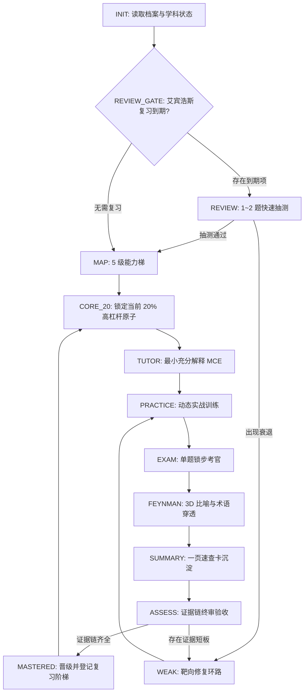

<div align="center">

# AI Personal Learning OS
### 协议规范 v1.1.0

基于确定性有限状态机 (FSM)、E1~E5 弹性证据链与艾宾浩斯间隔复习的个人工程化深度学习操作系统。

[](#)
[](#)
[](#)
[](#)
[](#)

[English](README.md) • [简体中文](README_zh.md)

[项目概述](#项目概述) • [核心架构哲学](#核心架构哲学) • [FSM 状态机拓扑](#fsm-状态机拓扑) • [E1~E5 证据链矩阵](#e1e5-证据链矩阵) • [艾宾浩斯复习引擎](#艾宾浩斯复习引擎) • [核心执行模块](#核心执行模块) • [双模式运行指南](#双模式运行指南) • [快速开始](#快速开始)

---

</div>

## 项目概述

**AI Personal Learning OS (`ai-learning-coach`)** 是一套严谨的工程化技术学习协议。它将 AI 从被动的「代码生成器 / 填鸭式保姆」转变为**带有长期记忆的技术抗阻教练、严苛考官与状态机裁决引擎**。

### 传统 AI 学习的两大通病
1. **虚假胜任感 (The Illusion of Competence)**：阅读 AI 详尽的解释让学习者误以为自己掌握了，但在白纸盲打、复杂时序心算或边界排错时瞬间崩溃。
2. **上下文失忆与膨胀 (Context Amnesia & Bloat)**：临时对话记录难以留存长期学习进度、思维盲区与已验证的能力证据。

`ai-learning-coach` 通过引入**确定性状态机 (FSM)**、**E1~E5 弹性证据链验收**、**艾宾浩斯 6 级间隔复习**以及**三权分立架构**，既可在本地文件系统 IDE (Cursor, Claude Code, Antigravity) 中全自动沉淀，也可在网页端大模型 (ChatGPT, Claude, Gemini) 中无缝流转。

---

## 核心架构哲学

```text
+-----------------------------------------------------------------------------------+
|                              三权分立架构 (THREE-TIER ARCHITECTURE)                |
+-----------------------------------------------------------------------------------+
|  [PROTOCOL 协议层]   SKILL.md             规则裁决优先级、FSM 引擎拓扑与状态交互契约 |
|  [MODULES 执行层]    modules/*.md         练习调度、单题考官、费曼审查、终验、复习门禁 |
|  [STATE 记忆层]      state/**/*.md        全局画像、各学科状态文件、会话归档流水     |
+-----------------------------------------------------------------------------------+
```

- **输出驱动 (Output-Driven)**：学员编写代码、推演执行序、简化心智模型；AI 施加认知阻力、诊断思维盲区并裁决状态晋级。
- **证据链验收 (Evidence-Based Mastery)**：掌握与否完全取决于是否点亮具体的实战能力证据 Token (`E1` 至 `E5`)，彻底杜绝主观上的「以为自己懂了」。
- **艾宾浩斯动态抗衰减 (Spaced Retention)**：已通关知识点自动纳入 6 级遗忘曲线复习队列，会话启动自动门禁抽测。
- **静默与精准反馈 (Zero-Noise State IO)**：去除无效客套与冗余状态复读；状态更新仅在阶段流转、执行 `/status` 和会话结束归档时发生。

---

## FSM 状态机拓扑

学习流程遵循严格的单向闭环有向图与靶向修复机制：



### 状态节点职责表

| 状态节点 | 核心职责 | 关联模块 / 模板 |
| :--- | :--- | :--- |
| `INIT` | 读取 `state/profile.md` 与学科状态；无档案时引导冷启动 | `state/profile.md` |
| `REVIEW_GATE` | 自动扫描到期知识点，派发 1~2 道极简高浓度抽测并动态调级 | `modules/review.md` |
| `MAP` | 生成 5 级能力路线图，并为各原子定义 `evidence_policy` | `modules/assessment.md` |
| `CORE_20` | 锁定当前级别最具杠杆效应的 20% 核心原子知识点 | `templates/subject-state.md` |
| `TUTOR` | 输出极简概念解释（MCE，代码示例严格控制在 15 行以内） | `SKILL.md` |
| `PRACTICE` | 根据原子属性动态调度匹配的实战训练模式 | `modules/practice.md` |
| `EXAM` | 单题锁步交互考核，给出定性诊断与启发式反馈（不泄题） | `modules/examiner.md` |
| `FEYNMAN` | 严查黑话术语，对学员的心智模型施加反向误导与极限并发压测 | `modules/feynman.md` |
| `SUMMARY` | 生成并归档符合规范的 1 页速查卡与避坑清单 | `templates/cheat-sheet.md` |
| `ASSESS` | 核查 `evidence_policy` 履约情况，裁决通关或打回修复 | `modules/assessment.md` |

---

## E1~E5 证据链矩阵

知识掌握必须通过对应实战证据 Token 的点亮来证明：

```text
  [ E1: Explain  ]   原理阐述：大白话解释底层机制与解决的核心矛盾
  [ E2: Predict  ]   心算推演：脱离运行环境，心算复杂作用域/时序推演结果
  [ E3: Build    ]   白板盲写：脱离补全与文档，独立写出符合工程标准的核心范式
  [ E4: Debug    ]   隐蔽排错：定位隐藏缺陷，说明根因并给出最小有效修复
  [ E5: Boundary ]   边界防御：指明该特性的反模式、性能隐患、副作用与适用边界
```

### 弹性证据策略配置 (Evidence Policy)
- **标准型 (Standard)**：必需 `[E1, E3, E5]` | 可选 `[E2, E4]`（如：设计模式、常用 API、状态管理）
- **深度原理型 (Mechanism)**：必需 `[E1, E2, E5]` | 可选 `[E3, E4]`（如：Event Loop、GC 垃圾回收、类型系统）
- **工具语法型 (Tooling)**：必需 `[E3, E4]` | 可选 `[E1]`（如：Git 命令、正则、构建配置、Shell 脚本）

### `/skip` 免修跳关挑战
输入 `/skip` 时，AI 会基于当前知识点的必需证据项合成一道**综合实战盲打题**。通过后直接点亮全部证据晋级；未通过则直接驳回并进入针对性修补。

---

## 艾宾浩斯复习引擎

已掌握知识点自动纳入 6 级艾宾浩斯间隔复习阶梯：

| 阶梯 (Stage) | 间隔时间 | 复习目标 | 考核通过动作 | 衰退处理动作 |
| :--- | :--- | :--- | :--- | :--- |
| **Stage 1** | +1 天 (24h) | 次日即时强化 | 升至 Stage 2 | 保持 Stage 1 |
| **Stage 2** | +2 天 (48h) | 短期抗衰减 | 升至 Stage 3 | 降至 Stage 1 |
| **Stage 3** | +4 天 (96h) | 结构内化复核 | 升至 Stage 4 | 降至 Stage 2 |
| **Stage 4** | +7 天 (1 周) | 中期心智稳固 | 升至 Stage 5 | 降至 Stage 3 |
| **Stage 5** | +15 天 (半月) | 跨模块迁移抗阻 | 升至 Stage 6 | 降至 Stage 4 |
| **Stage 6** | +30 天 (1 月) | 长期巩固 (PERMANENT) | 归入永久牢固池 | 降至 Stage 5 |

- **极简单题抽测 (Spot Exam)**：从知识点的 E2/E3/E4 证据中随机抽取 1 道实战题，单轮快速完成。
- **严重衰退惩罚**：若抽测严重不达标，立即从已掌握清单移入 `weak_atoms`，强制重新修补。

---

## 核心执行模块

### 1. 动态练习引擎 (`modules/practice.md`)
提供 6 大高强度训练模式：
- `BUILD`：依据严格工程契约从零盲写标准实现。
- `DEBUG`：排查修复具有迷惑性的隐蔽运行时或类型 Bug。
- `MODIFY`：重构具有坏味道或内存泄漏风险的代码。
- `PREDICT`：推演反直觉的异步执行序与上下文生命周期。
- `EXPLAIN`：使用结构化文本图解拆解协议时序。
- `DESIGN`：在特定领域约束下进行接口与架构建模。

### 2. 单题锁步考官 (`modules/examiner.md`)
- **单题锁步**：每轮对话严格仅出 1 道题。
- **启发式反馈**：绝不直接泄露答案，精准指出逻辑断层。
- **结构化评估输出**：评级、置信度、认知根因诊断、递进追问。

### 3. 费曼审查器 (`modules/feynman.md`)
- **术语穿透**：严禁使用黑话敷衍，要求直击底层运作机制。
- **3D 比喻压力测试**：审查映射完整性、反向误导性及极限并发崩溃点。

### 4. 恢复与中断协议 (`modules/recovery.md`)
支持随时使用 `/ask`、`/debug`、`/review` 挂起当前状态，答疑排错后无缝恢复考题现场。

---

## 实时中断指令集

| 指令 | 中文名称 | 功能与行为 |
| :--- | :--- | :--- |
| `/ask [问题]` | 临时答疑 | 针对当前考点细节释疑，解答完毕后自动恢复考场断点现场 |
| `/debug [代码/报错]` | 协同排错 | 启发式指出排错线索，引导学员亲自定位修复 |
| `/review` | 主动复习 | 打印当前学科遗忘曲线复习清单，唤醒到期知识点抽测 |
| `/skip` | 免修挑战 | 触发高难度综合挑战，通过后直接免修跳关 |
| `/status` | 进度简报 | 打印当前 Stage、当前原子目标、证据点亮情况与到期预警 |
| `/exit` | 归档结课 | 生成会话归档审计日志，更新并持久化学科状态文件 |

---

## 双模式运行指南

### 模式 A：本地 Agent 模式（推荐，全自动文件持久化）
*支持环境：Cursor, Antigravity, Claude Code, Codex, VSCode Copilot*

- **运行机制**：Agent 直接读写本地 `state/` 下的 Markdown 文件。
- **唤醒提示词**：
  ```text
  加载 @SKILL.md，读取 state/subjects/typescript.md，继续推进当前阶段。
  ```
- **生命周期**：状态随考核自动变更，结课时自动在 `state/sessions/` 生成审计流水。

### 模式 B：网页版 LLM 模式（零文件系统剪贴板桥接）
*支持环境：ChatGPT, Claude.ai, Gemini Web*

- **运行机制**：使用剪贴板作为状态输入输出桥梁。
- **操作步骤**：
  1. 将 `SKILL.md` 和 `modules/` 文件内容上传至 Custom GPT / Claude Project，或直接作为前置 Prompt。
  2. 粘贴 `state/subjects/{subject}.md` 的内容启动学习：
     ```text
     [粘贴 state/subjects/{subject}.md 内容]
     以此学科状态启动 AI Learning OS 协议。
     ```
  3. 会话结束输入 `/exit`，复制 AI 生成的最新 Markdown 代码块覆盖回本地文件保存。

---

## 项目结构

```text
ai-learning-coach/
├── README.md                         # 英文架构说明与指南
├── README_zh.md                      # 中文完整协议规范与操作手册
├── SKILL.md                          # 协议核心：FSM 引擎、规则仲裁与 IO 契约
├── docs/
│   └── USER_GUIDE.md                 # 详细操作手册与场景 Prompt 模板
├── modules/
│   ├── review.md                     # 艾宾浩斯 6 级间隔复习与快速抽测引擎
│   ├── practice.md                   # 6 种实战练习模式与动态调度策略
│   ├── examiner.md                   # 锁步考官与分级评审规则
│   ├── feynman.md                    # 术语穿透与 3D 比喻压力测试
│   ├── assessment.md                 # E1~E5 证据链策略与 /skip 跳关挑战
│   └── recovery.md                   # 中断快照与现场恢复协议
├── templates/
│   ├── cheat-sheet.md                # 1 页极简速查卡沉淀模板
│   ├── assessment-report.md          # 关卡结课终验报告模板
│   ├── subject-state.md              # 单学科持久化状态模板
│   └── session-log.md                # 单次会话审计流水日志模板
└── state/
    ├── profile.md                    # 全局个人学习画像与通病库
    ├── subjects/
    │   └── typescript.md             # 示例：TypeScript Level 2 状态档案
    └── sessions/
        └── 2026-09-20-typescript.md  # 示例：归档的历史学习会话日志
```

---

## 快速开始

### 1. 初始化一个全新学科
复制 `templates/subject-state.md` 至 `state/subjects/{学科名}.md`，设定初始等级。

### 2. 在 IDE Agent 中启动
在对话窗口中输入：
```text
加载 @SKILL.md，读取 state/subjects/typescript.md。
根据当前 current_stage: EXAM 和未完成证据 E3，直接出第 1 道实战考题，启动考官模式。
```

---

## 开源协议

本项目采用 [MIT 许可证](LICENSE)。欢迎将本协议应用于个人深度学习、团队技术培训与技术面试备战。
