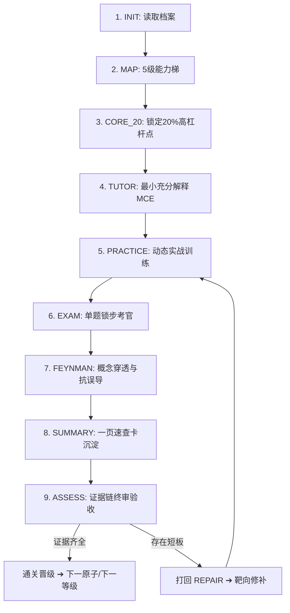

# AI Personal Learning OS 操作手册 (User Operating Manual)

> **版本**：v1.0.0  
> **适用环境**：本地 Agent (Cursor, Antigravity, Claude Code) / 网页版 LLM (ChatGPT, Claude.ai, Gemini)

---

## 1. 核心理念与机制

**AI Personal Learning OS (`ai-learning-coach`)** 不是被动的“代码生成器”或“有问必答的保姆”，而是一个**带有长期记忆的严苛技术考官与抗阻教练**。

```
┌────────────────────────────────────────────────────────────────────────┐
│                        AI PERSONAL LEARNING OS                         │
├───────────────────┬──────────────────────┬─────────────────────────────┤
│ 1. 状态机驱动 (FSM)│ 2. 证据链验收 (E1~E5) │ 3. 三权分立架构             │
│ 严格单向闭环流转，│ 拒绝“以为自己懂了”， │ Protocol(协议) + Modules(引擎)│
│ 禁止跳步与随意发散│ 必须点亮实战能力证据  │ + State(持久化记忆)          │
└───────────────────┴──────────────────────┴─────────────────────────────┘
```

---

## 2. 两种运行模式操作指南

### 模式 A：本地 IDE Agent 模式（推荐，全自动持久化）
**适用环境**：Cursor, Antigravity, Claude Code, VSCode Copilot

1. **唤醒与载入协议**：
   在 IDE 的 Agent 对话框中，直接引用 `@SKILL.md` 与目标学科状态文件：
   ```text
   加载 @SKILL.md，读取 state/subjects/typescript.md，继续推进当前阶段。
   ```
2. **全自动流转**：
   Agent 会自动读取 `state/` 下的文件，完成考核后自动更新 `state/subjects/{subject}.md`，结课时自动在 `state/sessions/` 生成日志文件。

---

### 模式 B：网页端 Web LLM 模式（剪贴板桥接）
**适用环境**：ChatGPT (GPT-4o), Claude 3.5 Sonnet, Gemini Pro/Advanced

1. **知识库配置**：
   - 将 `SKILL.md` 和 `modules/` 下的 5 个文件内容上传至 Custom GPT / Claude Project，或直接作为 System Prompt。
2. **启动会话**：
   - 复制本地 `state/subjects/{subject}.md` 的内容，粘贴给网页端 AI：
   ```text
   [粘贴 state/subjects/typescript.md 内容]
   以此学科状态启动 AI Learning OS 协议，推进当前任务。
   ```
3. **归档沉淀**：
   - 学习结束输入 `/exit` 时，AI 会输出最新的 `Subject State` 与 `Session Log` 代码块。
   - 手动将内容复制回本地对应的 `.md` 文件保存即可。

---

## 3. 标准学习流转全流程 (FSM SOP)



### 详细步骤说明

| 阶段 | 阶段名称 | 你的操作 / 行为 | AI 教练行为 |
| :--- | :--- | :--- | :--- |
| **1. INIT** | 档案初始化 | 提供学习目标、背景与可用时间 | 读取 `state/profile.md`，建立学科起点 |
| **2. MAP** | 5级能力梯 | 确认或调整学习路线图 | 生成 L1~L5 能力梯，为每个知识点标注 `evidence_policy` |
| **3. CORE_20** | 核心点锁定 | 确认进入当前最核心的 20% 原子知识点 | 聚焦单一原子目标，屏蔽后续干扰信息 |
| **4. TUTOR** | 极简输入 (MCE) | 阅读核心机制白话与最小示例 (≤15行) | 给出最小充分解释，禁止长篇大论灌输 |
| **5. PRACTICE** | 动态实战 | 依据 6 种模式完成代码手写、推演或排错 | 动态调度 `BUILD` / `DEBUG` / `PREDICT` 等模式发起训练 |
| **6. EXAM** | 锁步考官 | 独立答题，给出心智推演或白板实现 | **单题锁步**，严格评分（🟢/🟡/🟠/🔴），指出思维断层但不泄题 |
| **7. FEYNMAN** | 概念穿透 | 用大白话解释核心本质，或给出生活比喻 | 严查术语黑话（“穿透术语”），进行反向误导与极端并发压力测试 |
| **8. SUMMARY** | 速查沉淀 | 审阅并确认速查卡核心骨架与避坑清单 | 输出符合 `templates/cheat-sheet.md` 规范的 1 页速查卡 |
| **9. ASSESS** | 证据链终验 | 查验证据达成情况 | 清点 E1~E5 达成情况，裁决晋级 (`MASTERED`) 或打回 (`WEAK`) |

---

## 4. 实时中断指令集 (Interrupt Commands)

在学习过程中的**任何时刻**，你都可以直接输入以下指令打断或控制流程：

### `/ask [具体问题]` —— 临时精准答疑
- **场景**：对当前题目中的某个语法或底层细节有疑问，不想被考官当成答题。
- **行为**：AI 会就事论事进行原理解答，解答完毕后**自动恢复原考题现场**。
- **示例**：`/ask 这里的 infer R 为什么不能直接写在泛型参数列表里？`

### `/debug [代码/报错]` —— 启发式协同排错
- **场景**：写代码遇到奇怪报错卡住。
- **行为**：AI 绝不直接给出修改好的代码，而是指出调用栈或类型冲突线索，引导你亲自找出 Bug。
- **示例**：`/debug Type 'string' is not assignable to type 'never'`

### `/skip` —— 快速跳关测试
- **场景**：当前知识点你已经非常熟练，想直接跳过。
- **行为**：AI 立即生成 1 道**综合盲打题**（覆盖白板手写与边界条件）。作答通过（🟢）直接全量点亮证据链并跳关；未通过则直接驳回并进入靶向修补。

### `/status` —— 打印进度简报
- **场景**：查看当前学习状态与证据达成进度。
- **行为**：输出当前 Stage、当前原子目标、E1~E5 证据点亮情况以及薄弱项清单。

### `/exit` —— 结课与归档
- **场景**：本次学习结束准备休息。
- **行为**：自动生成本次学习日志（如 `state/sessions/2026-09-21-typescript.md`），更新学科状态并输出下次启动建议。

---

## 5. E1~E5 证据链验收标准

系统严禁以“我看懂了”、“明白”作为掌握标准，必须点亮对应证据 Token：

| Token | 证据名称 | 考核形式 | 通过判定标准 |
| :--- | :--- | :--- | :--- |
| **E1** | Explain 原理解释 | 机制拆解 / 费曼复述 | 能用无黑话的大白话讲清解决的核心矛盾与底层机制 |
| **E2** | Predict 执行推演 | 心算代码输出 / 时序推演 | 不运行代码，心算推演出复杂作用域/异步时序结果 |
| **E3** | Build 白板盲写 | 无提示独立手写 | 脱离补全与文档，独立写出符合工程标准的核心骨架与边界处理 |
| **E4** | Debug 隐蔽排错 | 缺陷代码诊断 | 准确定位隐藏缺陷，指出根因并给出最小有效修复 |
| **E5** | Boundary 边界防御 | 极限场景与反模式分析 | 准确指出该特性的适用边界、性能隐患、副作用与反模式 |

### 证据策略类型 (Policy)
- **标准型 (Standard)**：必需 `[E1, E3, E5]`（如：设计模式、常用 API、状态管理）
- **深度原理型 (Mechanism)**：必需 `[E1, E2, E5]`（如：Event Loop、垃圾回收、协程调度、类型系统）
- **工具语法型 (Tooling)**：必需 `[E3, E4]`（如：Git 命令、正则、构建配置、Shell 脚本）

---

## 6. 常见使用场景与 Prompt 模版

### 场景 1：开一门全新学科（例如 Rust）
```text
加载 @SKILL.md。我想系统学习 Rust，目前具备 3 年 TypeScript/Go 经验。
请根据协议为我初始化学科状态并生成 5 级能力梯 (MAP)。
```

### 场景 2：继续已有学科推进（例如 TypeScript）
```text
加载 @SKILL.md，读取 state/subjects/typescript.md。
直接进入当前阶段，向我出第一道实战考核题。
```

### 场景 3：针对薄弱点发起单点特训
```text
加载 @SKILL.md，读取 state/profile.md 中的全局工程通病。
我想针对“编写类型时习惯妥协使用宽松类型”发起 3 轮专项 DEBUG 训练。
```

---

## 7. 目录文件维护规范

```text
state/
├── profile.md                # 个人全局学习画像（跨学科通病、各学科等级索引）
├── subjects/
│   ├── typescript.md         # 单学科当前状态、当前原子点、证据点亮表、错题库
│   └── rust.md
└── sessions/
    └── 2026-09-20-typescript.md  # 每次使用 /exit 归档的单次学习日志
```

建议定期将 `state/` 目录提交至 Git，实现个人技术心智成长轨迹的完全可追溯与可量化。
