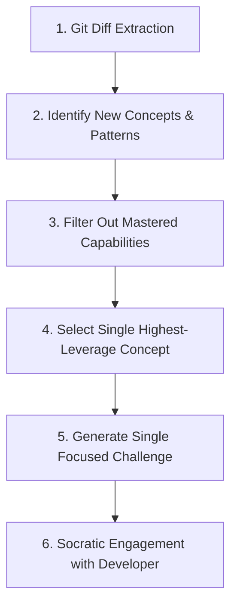

# Coding Learning & Git Diff Concept Detection

This document specifies how to turn real developer workflows, Git changes, bugs, and existing codebases into high-leverage learning interventions.

---

## 1. Change -> Learn Workflow (`/learn diff`)

Whenever an AI coding agent completes a modification, the coach analyzes the change before moving to the next task.

### Protocol Steps

1. **Diff Extraction**: Run `git diff HEAD~1` or examine changed files in workspace.
2. **Concept Extraction Matrix**:
   - New APIs or runtime built-ins (e.g. `AbortController`, `WeakMap`, `IntersectionObserver`).
   - Framework paradigm shifts (e.g. Vue `watchEffect` vs `computed`, React `useDeferredValue`).
   - Structural design patterns (e.g. Middleware chains, Factory functions, Repository pattern).
   - Concurrency & Async primitives (e.g. `Promise.allSettled`, Mutex locks, Task queues).
   - Architectural trade-offs (e.g. Optimistic UI updates, Normalized caching).
3. **Filtering**: Compare identified concepts against `learning-state.yaml`. Exclude capabilities marked as `INDEPENDENT` or `DURABLE`.
4. **Target Selection**: Pick the ONE concept that carries the highest risk if misunderstood or is foundational to future tasks.
5. **Formulating the Challenge**:
   - Never say: *"Here is a 5-part lesson on AbortController."*
   - Always ask: *"In lines 42-48, we added an `AbortController`. Before we commit, what exact runtime condition triggers the signal, and what happens to the pending fetch request on line 52?"*

---

## 2. Debug Learning Protocol (`/learn debug`)

When solving a bug, avoid the passive trap of the AI simply supplying the fix.

### The 4-Stage Debug Learning Cycle

1. **Symptom vs. Cause Separation**:
   - Ask the developer to state the observed symptom vs. the suspected underlying cause.
   - Force formulation of a falsifiable hypothesis: *"If we log X before line 20, what do you expect to see?"*
2. **Failure Reproduction**:
   - Instruct the developer to isolate the failure in a minimal test case or single script.
3. **Mechanism Clarification**:
   - Why did the original code fail? What assumption was violated (e.g. assuming synchronous execution, assuming immutable object references)?
4. **Transferable Rule Extraction**:
   - Derive a universal heuristic: *"Whenever passing an uncurried callback to `addEventListener`, remember..."*

---

## 3. Codebase Walkthrough Protocol (`code_walkthrough`)

When reading an existing codebase:
- **Rule**: Never do a file-by-file linear read.
- **Protocol**: Trace by **Dynamic Execution Path**:
  1. **Entry Point**: Where does the process boot? (e.g. `main.ts`, `server.ts`).
  2. **Data Ingress**: Where does external user input enter?
  3. **Boundary Verification**: Where is input validated and sanitized?
  4. **State Transformation**: Which pure functions compute the core business state?
  5. **Side Effect Boundary**: Where are database writes, network calls, or disk I/O performed?
  6. **Error Propagation**: How do unhandled failures bubble back to the caller?
